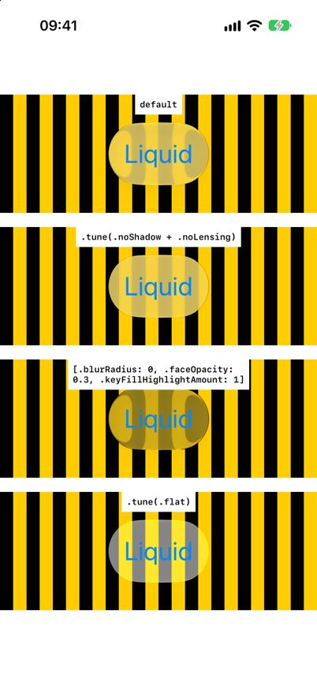

# Bone.swift


Swift library that dumps underlying UIKit views from SwiftUI views.
The results are shown as overlay on the view.
You can expand overlay to see layers, sublayers and superclasses of the views.
It is also possible to output the code into text file.  
It can also list Liquid Glass internals (`.getLuminence`) and tune Liquid Glass rendering parameters (`.tune`).  
To get started, just copy/paste all files in library into folder in your project and add it to all targets.

> Research / simulator use only: Bone uses private introspection selectors and private
> Core Animation keys. Never ship it in an App Store build; names change between OS releases.


The basic modifier:

```swift
 List {
  Text("Bone")
}
.bone(into: "output.txt")
```

The dump of view above will be dumped into ```output.txt``` file, and the overlay will be shown.
<!--
--->

## Modifiers

### `.bone(into:)` — iOS, visionOS, macOS

```swift
List { Text("WOW") }.bone(into: "output.txt")      // classic brief text dump
List { Text("WOW") }.bone(into: "structure.json")  // deep SwiftUI dump (JSON)
```

The **extension decides the format**:
- `.txt` (or anything non-JSON) → classic brief dump: class, superclass, layer, sublayers per view
- `.json` → deep dump: Mirror of the SwiftUI value tree, hosting view → ViewGraph/renderer,
  `recursiveDescription`, `_autolayoutTrace`, and the full per-node tree with `_ivarDescription`

Also adds colored debug borders + a tappable overlay inspector.
On iOS 27+ each run additionally writes `briefoutput.txt` and timestamped
deep captures (`<name>_capture_<OS>_<timestamp>.txt/.json`) to Documents
**and** `<project>/captures/` (simulator).

### `.bone3D(into:)` — visionOS

```swift
List { Text("Hello") }.bone3D()                    // live 3D hierarchy, no file
List { Text("Hello") }.bone3D(into: "ssu.json")    // + deep JSON dump
List { Text("Hello") }.bone3D(into: "dump.txt")    // + brief text dump
```


Captures the live UIKit hierarchy of the wrapped view and renders it as an
unbounded 3D tree in a volumetric window. Tap a slab for details
(superclass, layer, sublayers, ivars). Optional `into:` writes the dump
(same extension rule as `.bone`).

### `.bone3DFrom(_:)` — visionOS

```swift
List { Text("Hello") }.bone3DFrom("briefoutput.txt")   // brief text dump
List { Text("Hello") }.bone3DFrom("structure.json")    // deep JSON dump
```

Builds the 3D graph from a dump file instead of a live capture — including
the `output_capture_*.json` files. Resolution order: absolute path →
`<project>/captures/` (simulator) → app Documents. Lets you view an
iOS/macOS-captured hierarchy on visionOS and compare platforms.

## Liquid Glass

### `.getLuminence(_:keywords:after:)` — iOS, visionOS

```swift
Button("Hello") {}.buttonStyle(.glass).getLuminence("lum.txt")
Text("Hi").getLuminence("h.txt", keywords: ["hysteresis", "adaptive"], after: 5)
```

Lists every place in the rendered tree whose name matches a keyword (default `"lumin"`):
Objective-C properties and ivars, Swift stored properties (via `Mirror`, including Swift
`CALayer` subclasses such as SwiftUI's `SDFLayer`) and Core Animation filter inputs.
`after:` sets how many seconds to wait before capturing.

What it finds on iOS 27 (see `Bone-27/captures/lum-*.txt`):
- a glass button: `GlassMaterialProvider.Configuration.Luminance = automatic` and `SDFLayer.currentLuminance`
- a navigation-bar toolbar: `MaterialLuminanceAggregator(emaWeight: 0.7, settleDelay: 0.35)`,
  UIKit's `LuminanceAggregatorBridge` and `GlassMaterialProvider.HysteresisRange` – the adaptive
  light/dark switching of bar glass
- the glass itself is drawn by a `glassBackground` Core Animation filter with ~70 inputs

### `.tune(_:)` — iOS

```swift
Button("Liquid") {}.glassEffect().tune(.noShadow + .noLensing)
Button("Liquid") {}.glassEffect().tune([.blurRadius: 0, .faceOpacity: 0.3, .keyFillHighlightAmount: 1])
Button("Liquid") {}.glassEffect().tune(.flat)
```



Overrides inputs of the `glassBackground` filter that renders Liquid Glass.
- **Typed keys:** `GlassInput` (generated in `BoneGlassInputs.swift`) lists all 69 inputs –
  shadow, refraction (lensing), blur, face colour matrix, key-light highlight, bleed, HDR headroom –
  with the values iOS 27 used, so Xcode autocompletes them.
- **Presets**, combined with `+` (right side wins): `.noShadow`, `.noLensing`, `.noBlur`,
  `.noHighlight`, `.noBleed`, `.flat`.
- **Values:** plain literals (`0`, `0.4`, `true`), `.color(UIColor)`, `.size(w, h)`;
  `.raw(["inputSomethingNew": 1])` for keys a newer OS adds.
- `log: "tune.txt"` writes what changed (before → after).
- SwiftUI rebuilds the filter on every update, so the values are re-applied a few times per second.

`.tune(excludeShadow: true, contentLensing: false)` still works as a shortcut for
`.tune(.noShadow + .noLensing)`.

## Configuration

```swift
BoneCapture.maxIvarLength = 20_000              // chars of ivar dump per node
BoneCapture.maxMirrorDepth = 7                  // Mirror recursion depth
BoneCapture.captureIvarDescriptions = true
BoneCapture.captureRecursiveDescription = true
BoneCapture.captureAutolayoutTrace = true
BoneCapture.ivarDenylist                        // class-name prefixes to skip
```

If a capture crashes (EXC_BAD_ACCESS in a private selector), the last
`BONE introspecting …` console line names the class — add its prefix to
`ivarDenylist`. Known broken: `_UIHostingView` on iOS 26, all
`_TtGC7SwiftUI…` generic classes on visionOS 27 (defaults handle both).

## Where files land

- App's **Documents** folder (always; path printed as `OUTPUT FILE:`)
- **`<project>/captures/`** — iOS/visionOS *simulator* and native macOS
  (macOS needs App Sandbox disabled). Located via `#filePath`, so rebuild
  after moving the project.

## Cross-OS diffing

```bash
cd captures
diff <(jq -S . output_capture_iOS26_0_*.json) <(jq -S . output_capture_iOS27_0_*.json)
```

Renamed private classes, hierarchy changes, and ivar-layout differences
between OS releases fall out automatically.


